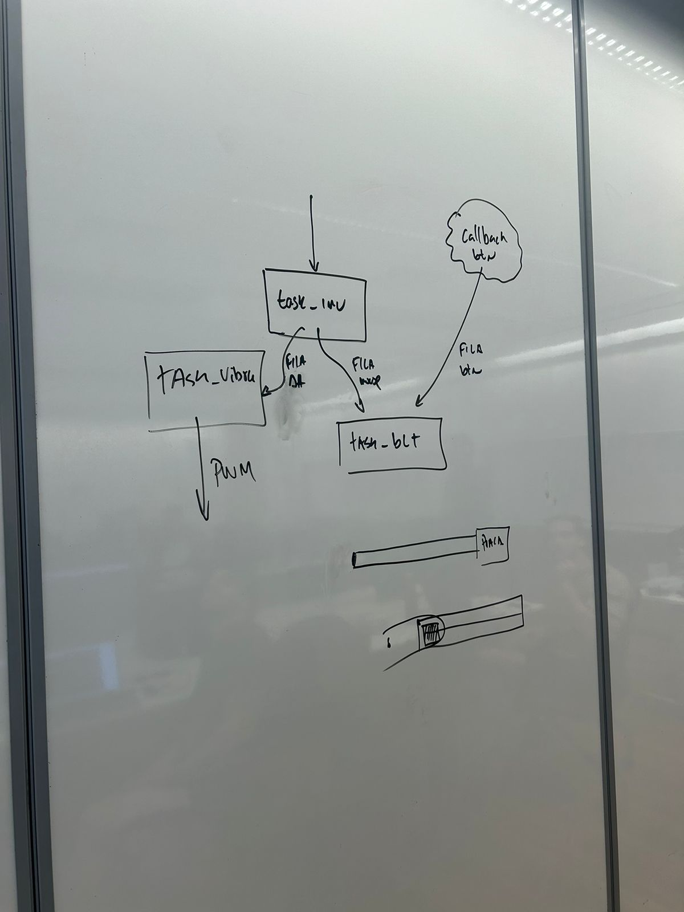
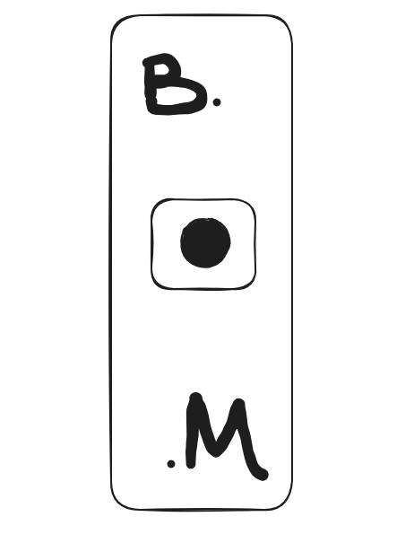

## SOBRE O JOGO:

### Bilhar 2D

O Billiards 2D é um jogo de bilhar gratuito, incluindo 8 bolas, 9 bolas, 15 bolas, 3 bolas, rotação e blackjack. Os gráficos são espetaculares e a física é realista e precisa. Quer você jogue contra o computador ou contra jogadores reais de todo o mundo online, a ação é tranquila e rápida! (Descrição do jogo na Steam).

## IDEIA DO CONTROLE:

A dinâmica do jogo é simples. Queremos um "controle" tal qual nós possamos clicar num botão para "carregar" a intensidade da batida do taco na bola e controla a direção com o mesmo. Quando soltamos o botão, a tacada é realizada.

## INPUTS E OUTPUTS

### Inputs
- Botão para carregar a intensidade e tacar a bola com o taco.

### Outputs
- LED que acende enquanto o botão estiver pressionado (podendo variar com intensidade).
- Vibrar (podendo variar com intensidade).

## DIAGRAMA DE BLOCOS
1. **Button callback**
- Responsável por monitorar o estado do botão.
- Quando o botão é liberado, a tacada é executada.

2. **IMU task**
- Monitora o movimento de "puxar o controle para trás" para determinar a intensidade da tacada. A intensidade aumenta à medida que o controle é puxado mais para trás.
- Responsável por monitorar o joystick ou o mouse e capturar a direção desejada durante o carregamento.
- Esta task está sempre rodando, capturando a posição para ajustar a direção da tacada.

3. **Bluetooth task**
- Realizar a conexão

4. **LED task**
- Controla o LED, acendendo enquanto o botão estiver pressionado e apagando quando o botão for solto. Variação de brilho por variação de intensidade.

## IMAGEM REPRESENTATIVA

